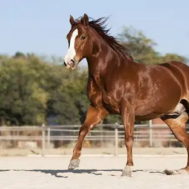

# Esto es una prueba de la Asignatura Lenguaje de Marcas

Introducción a __Lenguajes de Marcas__ 

## Lenguajes de marcas mas _utilizados_:
* XML
* HTML
* MARKDOWN
  
[__Pincha aqui para ser un caballo__](descarga.webp)

|Alfredo|SotoSombrio|
|:-------:|:-------:|
|Jose   |Electrico|
|Raymundo|[Gustoso](https://www.gustosdecoracion.es/)|

__Tabla sin cabecera__

|<!-- -->|<!-- -->|<!-- -->|
|:--------:|:--------:|:--------:|
|fila 1| fila2| fila3|
|fila 1| fila2| fila3|

### El Reino de los Unicornios Rosados

Había una vez, en un mundo lejano y mágico, un reino donde todo era color rosa. Desde las nubes hasta los árboles, cada rincón de este maravilloso lugar estaba impregnado de tonos suaves y vibrantes de rosa. Las flores eran como algodones de azúcar, y el aire estaba perfumado con el dulce aroma de las fresas y las flores silvestres. Este era el Reino de los Unicornios Rosados, un lugar donde la belleza y la magia se entrelazaban en cada esquina.

En el corazón de este reino vivía una joven llamada Lila. Su cabello, del color de las flores de cerezo, caía en suaves ondas sobre sus hombros. Lila era conocida por su bondad y su amor por los animales, especialmente por los unicornios, que eran criaturas majestuosas y únicas en su especie. Cada día, Lila pasaba horas en el Bosque de los Sueños, donde los unicornios rosados pastaban y jugaban en la pradera.

Los unicornios no solo eran hermosos, sino que también poseían un poder mágico: podían hacer que los deseos más profundos de quienes los encontraban se hicieran realidad. Sin embargo, había una regla en el Reino de los Unicornios Rosados: solo aquellos con un corazón puro podrían acercarse a ellos. Lila, con su naturaleza amable y generosa, era una de las pocas personas que había tenido la suerte de tocar a uno de estos seres mágicos.

Un día, mientras exploraba el bosque, Lila escuchó un suave relincho que la hizo detenerse en seco. Era un sonido melodioso, como un canto que flotaba en el aire. Siguiendo el sonido, se adentró más en el bosque, donde los rayos de sol filtraban a través de las hojas, creando un espectáculo de luces y sombras. De repente, se encontró frente a un hermoso unicornio rosado, de brillante pelaje y un cuerno reluciente que destellaba con los colores del arcoíris.

“Hola, Lila,” dijo el unicornio, su voz suave como un susurro. “Soy Aurora, la guardiana de este bosque.”

Lila se quedó sin palabras. Nunca había hablado con un unicornio antes. “¡Hola, Aurora! Es un placer conocerte,” respondió, con la emoción brillando en sus ojos.

“Te he estado observando,” continuó Aurora. “Tu bondad y amor por los demás son verdaderamente inspiradores. Por eso, quiero ofrecerte un regalo especial.”

Lila no podía creer lo que estaba escuchando. “¿Un regalo? ¿Qué es?”

“Un viaje a la Montaña de los Sueños,” explicó Aurora. “Allí encontrarás la Fuente de la Felicidad, que puede hacer que tus sueños más anhelados se hagan realidad. Pero ten cuidado, Lila. El camino está lleno de desafíos, y solo los valientes podrán llegar.”

Con el corazón palpitando de emoción, Lila aceptó la invitación de Aurora. Juntas, emprendieron un viaje a la Montaña de los Sueños, atravesando campos de flores rosadas y ríos de agua cristalina. A medida que avanzaban, Lila notó que el cielo se volvía aún más brillante y los colores más intensos. Era como si el mundo entero estuviera celebrando su viaje.

Sin embargo, no pasó mucho tiempo antes de que se encontraran con el primer desafío: un puente colgante hecho de chicle rosa que cruzaba un abismo profundo. “Debemos cruzar este puente, pero hay un guardián que solo permitirá pasar a aquellos que respondan a su acertijo,” explicó Aurora.

Lila se sintió nerviosa, pero decidió enfrentar el desafío con valentía. Al llegar al puente, se encontró con un pequeño dragón de color rosa que miraba con curiosidad. “Hola, pequeña aventurera. ¿Te atreves a responder mi acertijo?” preguntó el dragón.

“¡Sí!” respondió Lila, sintiendo que la adrenalina corría por sus venas.

“Soy ligero como una pluma, pero el hombre más fuerte no puede sostenerme por mucho tiempo. ¿Qué soy?” inquirió el dragón.

Lila pensó por un momento, recordando las historias que había oído de su abuela. De repente, la respuesta llegó a su mente. “¡El aliento!” exclamó.

El dragón sonrió y movió su cola con alegría. “¡Correcto! Puedes cruzar el puente.” Con una reverencia, Lila y Aurora cruzaron el puente de chicle, riendo y disfrutando del momento.

Después de varias horas de viaje, llegaron a la base de la Montaña de los Sueños. Era aún más hermosa de lo que Lila había imaginado, con cimas brillantes que reflejaban el sol y un suave resplandor rosa que emanaba de la piedra. Pero la subida no sería fácil. El sendero estaba cubierto de piedras brillantes que resbalaban, y el aire era un poco más frío.

Sin embargo, Lila estaba decidida. Con la ayuda de Aurora, comenzaron a escalar. Cada vez que Lila se sentía cansada, Aurora la motivaba con palabras de aliento. “Recuerda por qué estás aquí, Lila. Tus sueños están al final de esta montaña.”

Finalmente, después de lo que pareció una eternidad, llegaron a la cima. Allí, ante ellas, estaba la Fuente de la Felicidad. Era una fuente deslumbrante, con agua que brillaba como diamantes y emitía un suave murmullo que llenaba el aire con melodías dulces. Lila se acercó y llenó su cuenco con el agua mágica.

“Ahora, piensa en tu deseo más profundo,” dijo Aurora, observando con expectación.

Lila cerró los ojos y pensó en todos sus sueños. Anhelaba que la bondad y el amor reinara en el mundo, que las personas se cuidaran unas a otras y que nunca hubiera tristeza. Con el corazón lleno de esperanza, bebió del agua y sintió una cálida energía fluir a través de ella.

De repente, el cielo se iluminó con un resplandor mágico, y una oleada de energía rosa se extendió por todo el reino. Lila sonrió, sintiendo que su deseo se estaba haciendo realidad. Al abrir los ojos, vio que los unicornios rosados estaban danzando en la montaña, llenando el aire con risas y alegría.

Al regresar a casa, Lila se dio cuenta de que el mundo había cambiado. La bondad y la felicidad se habían extendido por todo el Reino de los Unicornios Rosados. La gente se abrazaba y se ayudaba mutuamente, creando una comunidad más unida y amorosa.

Desde ese día, Lila y Aurora continuaron explorando el reino, ayudando a otros a descubrir la magia del amor y la bondad. Y aunque los unicornios rosados eran criaturas raras, cada vez que alguien se acercaba a ellos con un corazón puro, la magia del reino florecía una vez más.

Y así, en el Reino de los Unicornios Rosados, la felicidad y el amor reinaron por siempre, todo gracias a la valentía de una joven y la magia de un unicornio. Fin.